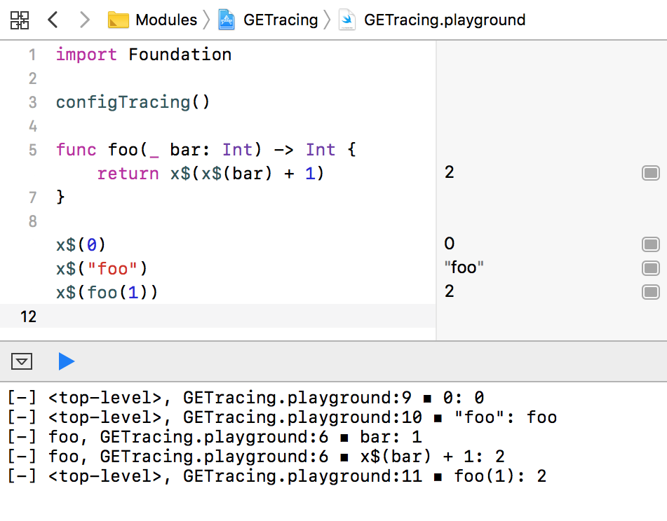

# GETracing

Easily trace value *and literal* of a Swift expression right at the point of evaluation.

## Why

* Avoid repeating yourself.
* Avoid introducing variables just to keep a value of expression (otherwise re-evaluated) for logging. Evaluate just once, whether there's tracing or not.
* Get the expression literals traced in addition to the values.
* Keep the code changes to the minimum. Make tracing (and reverting from tracing) as seamless as possible.

## What

Any Swift expression

    expr

that needs tracing is replaced with

    x$(expr)

and that's it. Nested expressions might be traced as well. 

## Configration

`x$` alternative might be [defined as necessary](x-source-tag://Tracing-Function-Sample) by the client. 

Logging implementation should be [defined](x-source-tag://Tracing-Sample-Loggers-Configuration) by the client.

## Reverting

Tracing might be reverted by removal of `x$()` or even removal of `x$`, leaving `()` in place.

Alternatively, tracing might be disabled per-block.

## Current Limitations

It's required to bundle the corresponding source files together with the modules, if you want to see the expression literals for the traced stuff, as they're looked up at runtime. It might be improved later. For now, for performance reasons, it's possible to disable the lookup completely. (Theoretically) it's possible to recover the literals given the traced output with lookups disabled.

## Related Projects

[Tuna Xcode Plugin](https://github.com/dealforest/Tuna)
